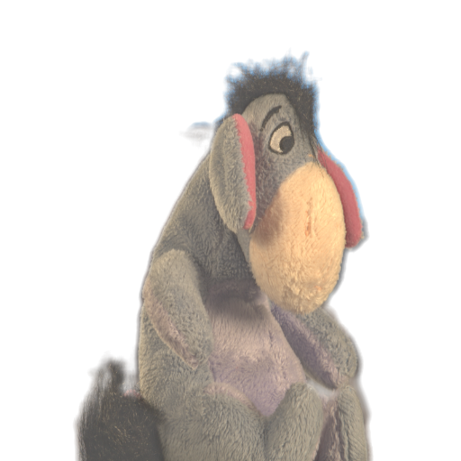

# This repo reimplements DCNN for image matting.

In this repo, we use shared matting to replace knn matting method, caused by the error of knn matting.
Furthermore, the knn matting is too slow.   

## Usage

### Dependency
```shell
numpy==1.14
tensorflow==1.12.0
opencv-python
scipy
imageio
scikit-learn
```

### Data generation

1. 
1.1. Download the images and mattes from `alphamatting.com`.

1.2. Download the `MSCOCO` dataset, then uncompress to any folder.

2. Modify the `config.py` to adapt to your customed environment and parameters.

3. Run `python gen_alpha_from_closed_form.py` to generate the closed form mattes.

4. Run `python gen_alpha_from_sharedmatting.py` to generate the shared matting mattes( Replace the knn matting).

5. Run `python data_prepare.py --stage=gen_composite_images` to generate the composite images.

6. RUN `python data_prepare.py --stage=gen_image_patches` to generate the image patches.

7. RUN `python data_prepare.py --stage=train_val_test_split` to split the train, val, test datasets.

Then we use these patches to train this model.
There are totally 270000 patches for all images.

### Train
8. RUN `python train.py` to train this model, the log and ckpt will be stored in ./logs and ./ckpt

### Demo
9. RUN `python demo.py` to test one image matting.


### Test result

